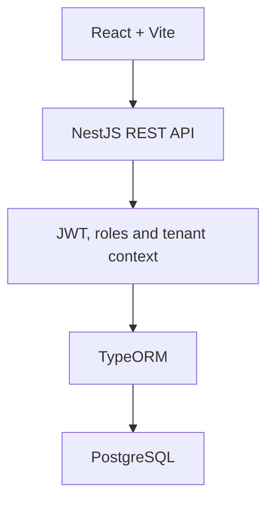

# Rango Store

[](https://github.com/vegaU/rango-store/actions/workflows/ci.yml)
[](https://rango-store.vercel.app)

A multi-tenant sales and inventory management system for automotive parts and accessories businesses.

Rango Store is a full-stack portfolio project built to explore tenant-aware architecture, authentication, role-based access, inventory workflows, and the connection between a React interface and a NestJS REST API.

> **Status:** Functional prototype under active development.

## Live demo

Frontend deployment: [https://rango-store.vercel.app](https://rango-store.vercel.app)

The public deployment demonstrates the user interface. Some features require a configured backend and PostgreSQL database.

## What this project demonstrates

- Full-stack application development with React and NestJS.
- Tenant-aware request handling.
- JWT authentication and role-based authorization.
- REST API design with controllers, services, DTOs, and entities.
- PostgreSQL persistence through TypeORM.
- Protected frontend routes and role-aware navigation.
- Responsive administration interface with light and dark themes.
- Deployment of a React application with Vercel.

## Main capabilities

- Company registration and tenant management.
- User authentication and protected routes.
- Roles for administrative and operational access.
- Products and categories.
- Customers and suppliers.
- Purchases and sales.
- Stock movement tracking.
- Dashboard, reports, and settings areas.
- Tenant selection through JWT data, headers, or subdomains.

## Architecture



## Technology stack

| Layer | Technologies |
| --- | --- |
| Frontend | React 19, React Router, Vite, Tailwind CSS |
| Backend | Node.js, NestJS 11, TypeScript |
| Authentication | JWT, bcrypt |
| Database | PostgreSQL, TypeORM |
| Validation | class-validator, class-transformer |
| Deployment | Vercel |
| Quality | ESLint, TypeScript compilation, GitHub Actions |

## Project structure

```text
rango-store/
├── src/                    React application
│   ├── components/         Shared interface components
│   ├── layouts/            Application layout
│   ├── pages/              Business screens
│   ├── routes/             Authentication and role guards
│   └── lib/                API, auth, and permissions
├── backend/                NestJS REST API
│   └── src/
│       ├── auth/           JWT authentication and roles
│       ├── tenants/        Tenant context and isolation
│       ├── products/       Product catalog
│       ├── customers/      Customer management
│       ├── providers/      Supplier management
│       ├── purchases/      Purchasing
│       ├── sales/          Sales
│       └── stock-movements/
└── .github/workflows/      Continuous integration
```

## Run locally

### Requirements

- Node.js 22+
- npm
- PostgreSQL

### 1. Clone and install dependencies

```bash
git clone https://github.com/vegaU/rango-store.git
cd rango-store
npm ci
npm --prefix backend ci
```

### 2. Configure the environment

```bash
cp .env.example .env
cp backend/.env.example backend/.env
```

Create a PostgreSQL database named `rango_store`, configure the database values in `backend/.env`, and replace the example JWT secret before using the application outside local development.

The frontend uses `VITE_API_URL` for the NestJS API. It also contains an optional PostgREST compatibility layer for product data.

### 3. Start the backend

```bash
npm run backend:dev
```

The API runs at [http://localhost:3001/api](http://localhost:3001/api). Its health endpoint is available at `GET /api/health`.

### 4. Start the frontend

In another terminal:

```bash
npm run dev
```

Open [http://localhost:5173](http://localhost:5173).

## Quality checks

```bash
npm run lint
npm run build
npm run backend:build
```

GitHub Actions validates the frontend lint and production build as well as the NestJS backend compilation.

## Roadmap

- Complete the integration of every frontend module with the NestJS API.
- Add automated backend and frontend tests.
- Add Swagger/OpenAPI documentation.
- Dockerize the complete development environment.
- Publish demo data and product screenshots.
- Improve error handling and loading states.

## Author

Developed by [Inocencio Vega](https://github.com/vegaU).
